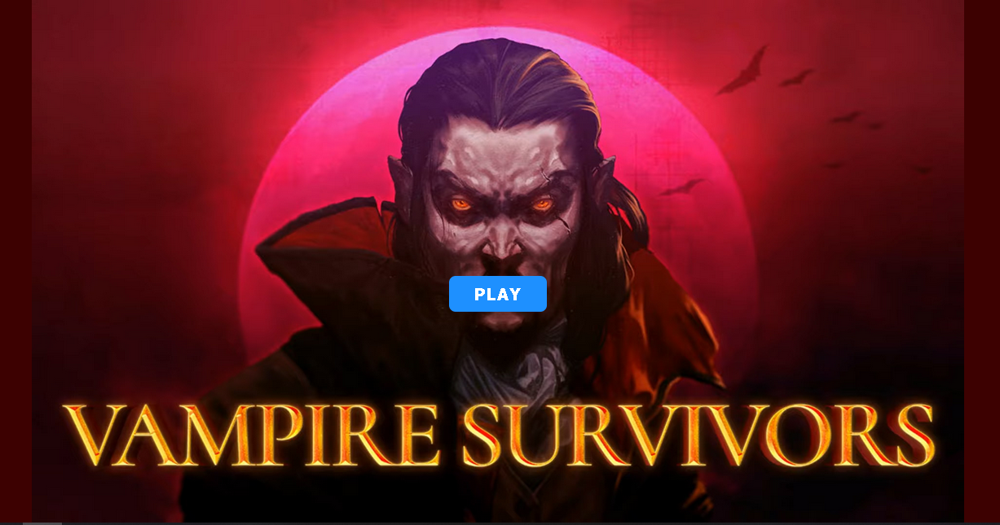
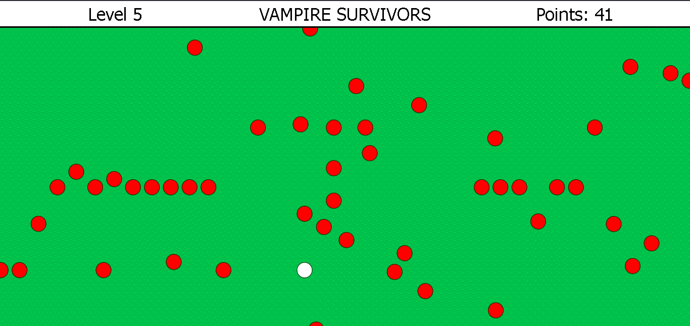
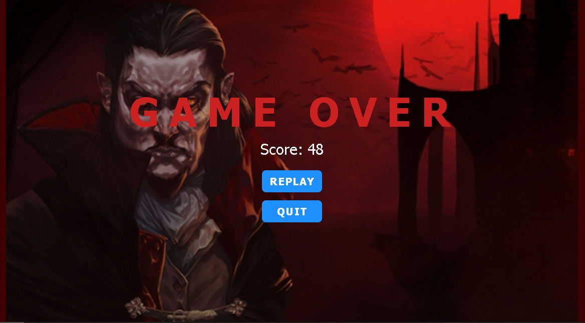

# 🧛‍♂️ Vampire Survivors – Web Game  

Ein einfaches **Survival-Spiel im Stil von Vampire Survivors**, programmiert mit **HTML5, CSS3 und JavaScript**.  
Steuern Sie Ihren Charakter, weichen Sie Zombies aus und überleben Sie so lange wie möglich, um Punkte zu sammeln.  

---

## 🚀 Features  
- Spielfigur (weiß) steuerbar mit den Pfeiltasten ⬆️⬇️➡️⬅️  
- Gegner (rote Zombies) bewegen sich auf den Spieler zu  
- Survival-Prinzip: solange wie möglich überleben und Punkte sammeln  
- Game Over, wenn der Spieler getroffen wird  
- Anzeige der erreichten Punkte am Spielende  
- Möglichkeit, sofort eine neue Runde zu starten  

---

## 🛠️ Technologien  
- HTML5  
- CSS3  
- JavaScript  

---

## 📦 Installation & Nutzung  
1. Repository klonen oder herunterladen  
2. Projektordner öffnen  
3. Datei `vs_start.html` im Browser starten  
   👉 Das Spiel läuft direkt lokal, kein Server erforderlich.  

---

## 🎮 Spielanleitung  
1. `vs_start.html` im Browser öffnen  
2. **PLAY**-Button klicken, um das Spiel zu starten  
3. Mit den **Pfeiltasten** bewegen (⬆️⬇️➡️⬅️)  
4. Weichen Sie den Zombies (rot) aus  
5. Ziel: **So lange wie möglich überleben und Punkte sammeln**  
6. Wenn ein Zombie den Spieler trifft → **Game Over**  
7. Am Ende Punkte einsehen und auf Wunsch eine neue Runde starten  

---

## 🖼️ Screenshots  

  
  

---

## 📄 Hinweis  
Dieses Projekt ist ein **Lern- und Spaßprojekt** und dient zur Demonstration von Browser-Games mit reinen Web-Technologien.  

---

## 👤 Autor  
**Yvan Zambou**  

  
  

---
